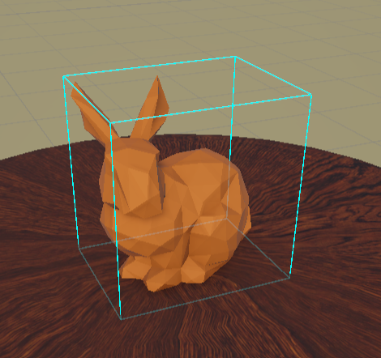
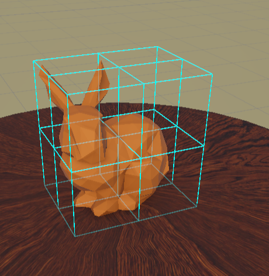
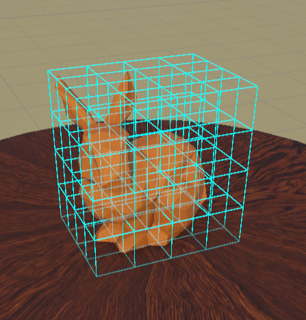
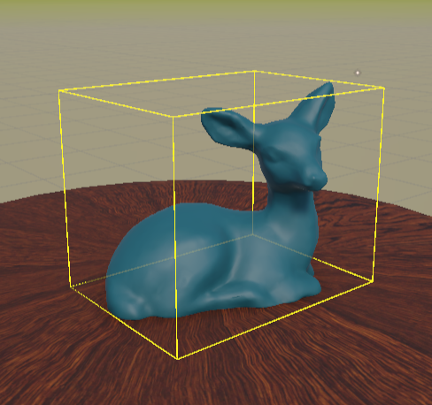
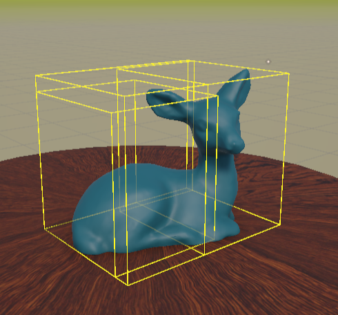
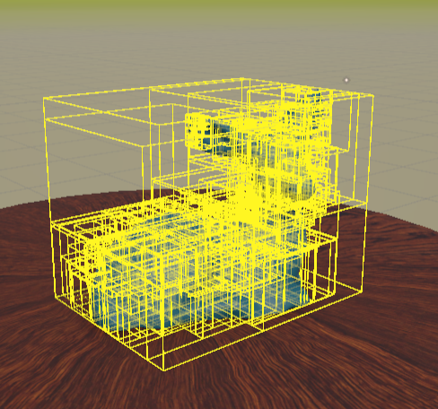
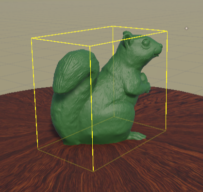
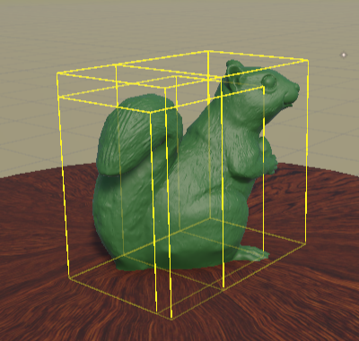
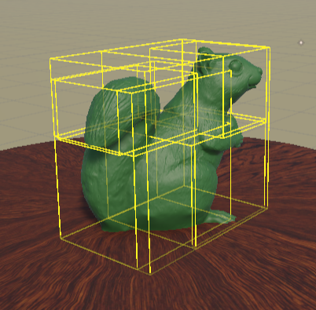
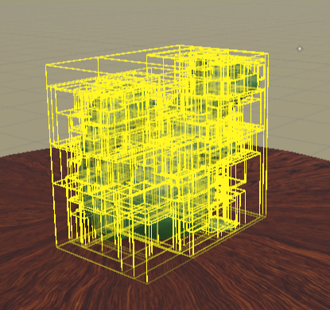

# 🧩 Spatial Acceleration Structures in Computer Graphics

This project implements core spatial acceleration structures commonly used in computer graphics, built entirely from scratch in Unity for learning and experimentation.
Each structure is constructed on triangle meshes, visualized in real time using Unity Gizmos.

The repository includes:
- **Octree** — uniform spatial subdivision of 3D space
- **KD-Tree**
  - Object-based (centroid split)
  - Spatial (space-partitioning with triangle duplication)
- **BVH (Bounding Volume Hierarchy)**
  - Median split BVH
  - Hybrid BVH using Surface Area Heuristic (SAH)

---

## 🌳 Tree Visualizations

Each row shows how different spatial acceleration structures subdivide space and geometry at increasing tree depths (0, 1, 2, and 8).

#### Octree — Uniform Spatial Subdivision (Depths: 0, 1, 2, 8)

  
  
  
  

#### KD-Tree — Axis-Aligned Space Partitioning (Depths: 0, 1, 2, 8)

  
  
  
  

#### BVH — Bounding Volume Hierarchy (Depths: 0, 1, 2, 8)

  
  
  
  

---

